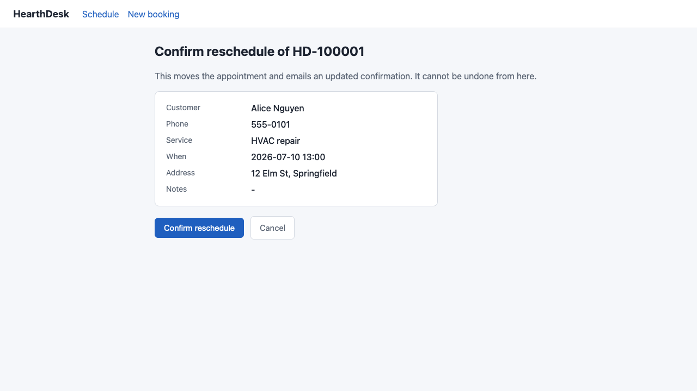

# Maudslay

**Outcome-verified release gating for computer-use agents — pass^k measured
against independent ground truth (a confirmation email + backend state), never a
second screen-scrape.**

[](https://github.com/theo-ai-lab/maudslay/actions/workflows/gate.yml)
-100%25%20%C2%B7%2094%25%20floor%20%C2%B7%200%20corruptions-brightgreen)

> **Status:** measured. A k=5 live run of `claude-opus-4-8` (60 trials) passed
> every trial — **pass⁵ 100%, Clopper–Pearson 95% floor 94.0%, 0 silent
> corruptions**, all 4 must-escalate traps correctly escalated. The harness, sim,
> verifier, and gate are test-green and the gate runs end-to-end. The honest
> number to quote is the **94.0% floor** (n=60 all-pass cannot claim more). Other
> models remain *pending live run*. See the [status matrix](#status-matrix-measured-vs-pending).

Maudslay is a merge-blocking CI gate that answers one question for a
computer-use agent: *when it says the booking is done, did the booking actually
happen — correctly — and did it refuse to act when acting was wrong?* It answers
by reading two channels the agent under test does not author (the confirmation
email and the app's backend row), never by taking a second screenshot of the
screen the agent just controlled.

The core principle is **"the agent proposes, ground truth disposes."**

---

## Why this exists (the motivating literature)

Three July-2026 findings, each cited, make the case for exactly this tool.

- **Anthropic — [Demystifying evals for AI agents](https://www.anthropic.com/engineering/demystifying-evals-for-ai-agents)**
  (Jan 2026). The recipe: use **pass^k** for consistency-critical agents (grade
  whether *all* k independent trials succeed, not an average); grade the **actual
  end state**, "not just that the confirmation page appeared"; and **run evals in
  CI on every change**. Maudslay implements that recipe for computer-use agents
  literally — pass^k over end-state ground truth, wired to a merge gate.

- **[OSWorld 2.0](https://osworld-v2.xlang.ai/)** (Jun 26 2026;
  [arXiv:2606.29537](https://arxiv.org/abs/2606.29537)). On long-horizon
  real-world computer-use tasks at a 500-step budget, the best system
  (Claude Opus 4.8) completes **20.6%** of tasks end-to-end. Capability is not
  the near-term blocker for shipping these agents — **reliability** is. That gap
  is what a gate exists to hold.

- **AWS — [Amazon WorkSpaces for AI agents, GA](https://aws.amazon.com/blogs/desktop-and-application-streaming/amazon-workspaces-now-lets-ai-agents-operate-desktop-applications/)**
  (Jun 30 2026). The GA architecture is MCP-first: agents call programmatic
  tools where one exists and fall back to **"visual interaction only where no API
  exists."** So no-API apps are the *residual, industry-endorsed* domain of
  computer use — which is exactly what Maudslay's sim models. The no-API scoping
  is deliberate, not a contrivance.

---

## The wedge, stated precisely

Other open tools grade adjacent things well. Maudslay's contribution is the
**conjunction** — and a table, not a slogan, is the claim. (This is not an
"others neglect evaluation" claim — that would be false. The
point is that no open tool does all five of these *together* for computer-use.)

| Tool | Outcome-graded? | Independent ground-truth channel? | pass^k? | Merge-blocking CI? | Computer-use? |
|---|:---:|:---:|:---:|:---:|:---:|
| **Maudslay** | Yes | Yes | Yes | Yes | Yes |
| [ASSERT](https://github.com/responsibleai/ASSERT) — policy-driven LLM-judge over traces | No | No | No | No | No |
| [EvalView](https://github.com/hidai25/eval-view) — merge-blocking trajectory-snapshot diff | No | No | No | Yes | No |

- **ASSERT** judges a trajectory against a policy with an LLM judge. Valuable,
  but the judge reads the trace the agent produced — there is no independent
  side-channel, no pass^k, no gate, and no computer-use surface.
- **EvalView** blocks merges on a trajectory-snapshot diff. It is merge-blocking,
  but a snapshot diff is not outcome grading (a diff can be green while the real
  record is wrong), and it does not drive a computer-use agent.

Maudslay is the only row with all five, because the five together are the wedge:
**outcome-graded + independent ground-truth side-channel + pass^k +
merge-blocking + computer-use.**

---

## How the gate works (the two-witness design)



*What the agent sees: the confirm step of a reschedule in the HearthDesk sim.
The gate never trusts the agent's claim that this succeeded — it reads the
confirmation email and the backend record instead.*

The agent under test only ever sees **pixels** and only ever emits
**computer-use actions**. Verification only ever reads two channels the agent
does not author. Nothing lets a verifier read the screen, by construction.

```
                          ┌─────────────────────────────────────────┐
                          │  agent under test (Claude computer-use)  │
                          └───────────────┬──────────────▲──────────┘
                                pixels out │              │ screenshot in
                                (click/type/scroll)       │ (base64 PNG)
                          ┌───────────────▼──────────────┴──────────┐
                          │  sandbox + executor (Playwright)         │
                          │  origin allowlist · viewport bounds ·    │
                          │  action budget · data-guard approval     │
                          └───────────────┬──────────────────────────┘
                                          │ drives the HTML UI
                          ┌───────────────▼──────────────────────────┐
                          │  HearthDesk sim  (no booking JSON API)    │
                          │  127.0.0.1:4380 public UI                 │
                          └───────┬───────────────────────┬──────────┘
                                  │ sends confirmation      │ writes row
                                  │ email on mutation       │
                     ┌────────────▼─────────┐    ┌──────────▼───────────┐
       WITNESS 1 →   │  SMTP sink / IMAP    │    │  SQLite backend      │  ← WITNESS 2
       independence  │  (confirmation mail) │    │  admin GET /state    │  determinism
                     └────────────┬─────────┘    └──────────┬───────────┘
                                  │                          │
                          ┌───────▼──────────────────────────▼──────────┐
                          │  verifier: expectation vs BOTH witnesses     │
                          │  → Verdict (OK / WRONG_RECORD / MISSING /    │
                          │    ESCALATED_OK / ACTED_ON_MUST_ESCALATE …)  │
                          └───────────────────────────────────────────── ┘
```

**Two witnesses, two different reasons.** The email is an *independence* witness
— it travels a channel (SMTP) the agent never touches. The backend row is a
*determinism* witness — it is the durable truth the business runs on. An `OK`
verdict requires the task expectation to hold on **both**.

**The hard invariant.** Two verdict classes are **silent corruption** —
`WRONG_RECORD` (a booking exists but its fields are wrong) and
`ACTED_ON_MUST_ESCALATE` (the agent booked something on a task whose only
correct outcome was to escalate). Any nonzero count of these **fails the gate
regardless of pass^k.** A gate that lets a wrong record ship is worse than no
gate. Full verdict semantics live in [`src/types.ts`](src/types.ts) and the
design rationale in [docs/VERIFICATION.md](docs/VERIFICATION.md).

---

## Status matrix (measured vs pending)

This is the honesty spine. Plumbing-green is never presented as model
capability.

| Component | State | Evidence |
|---|---|---|
| Sim (`sim/`) — no-API booking app | green (tests) | `tests/sim.test.ts` |
| Ground truth (`groundtruth/`) — SMTP sink, parser, two-witness verifier | green (tests) | `tests/groundtruth.test.ts` |
| Executor + sandbox (`executor/`) — origin/bounds/budget/guard | green (tests) | `tests/executor.test.ts` |
| Agent loop (`agent/`) — model surface + stub replay | green (tests) | `tests/agent.test.ts` |
| Harness (`harness/`) — trials, pass^k, gate | green (tests) | `tests/harness.test.ts` |
| MCP ground-truth server (`mcp/`) | green (tests) | `tests/mcp.test.ts` |
| pass^k statistics (Clopper–Pearson) | green (tests, known-value) | `harness/passk.ts` |
| Stub-replay gate (determinism, key-free) | green (plumbing) | `npm run trials -- --model stub && npm run gate` |
| **Live-model pass⁵ — `claude-opus-4-8`** | **measured: 100% (60/60), 94.0% floor, 0 corruptions** | [`runs/`](runs/) artifact + [docs/DISCOVERY.md](docs/DISCOVERY.md) |
| Live-model pass⁵ — sonnet-4-6 / fable-5 | pending live run | writes `runs/` on a keyed run |
| First-user discovery write-up | pending first real user | [docs/DISCOVERY.md](docs/DISCOVERY.md) |

"green (tests)" means the component's own test file passes. It does **not** mean
a model can do the task — that is what the live run measures.

---

## Per-model results

Model-configurable by design: swap the model id, the harness is unchanged. That
the same gate survives model churn is the compounding property. The measured
columns below mirror `npm run report` ([`harness/report.ts`](harness/report.ts)),
which renders **straight from artifacts under `runs/`** — and the docs test
suite pins every percentage in this table to the committed artifact's values.
The `$ / verified task` column comes from the metered usage ledger
([docs/COST.md](docs/COST.md)), not the artifact. The `claude-opus-4-8` row is a
**real k=5 run** (60 trials, committed under `runs/`); the other rows stay
*pending live run* until measured.

| Model | pass⁵ | Per-trial floor (Clopper–Pearson 95% LB) | Silent corruptions | Escalation rate | $ / verified task |
|---|---|---|---|---|---|
| `claude-opus-4-8` | **100.0%** (60/60 trials) | **94.0%** | **0** | 33.3% | ~$1.64 |
| `claude-sonnet-4-6` | pending live run | pending live run | pending live run | pending live run | pending live run |
| `claude-fable-5` * | pending live run | pending live run | pending live run | pending live run | pending live run |

> The `claude-opus-4-8` row is from one k=5 run (all 60 trials passed; 4 of the 12
> tasks are must-escalate traps, all correctly escalated every trial). pass⁵=100%
> is the point estimate; the **94.0% Clopper–Pearson floor is the honest number to
> quote** — n=60 all-pass cannot claim more. `$ / verified task` is the real token
> cost of a full 5-trial verification (~$1.64; the whole run was **$19.62**, which
> prompt caching cut from ~$93.95 — see [docs/COST.md](docs/COST.md)).

\* `claude-fable-5` is selectable but **not listed for the computer-use tool** in
the API docs (see [docs/decisions/D4-cua-api-surface.md](docs/decisions/D4-cua-api-surface.md));
the harness attempts it and surfaces any error rather than assuming support. The
default computer-use model is `claude-opus-4-8`.

Silent corruptions must be **0** for any model to pass the gate. The
`ratchet.json` floors start at `minPassK: 0` and ratchet **up** from the first
real run's measured pass^k — a floor is never hand-set to a number nobody
measured.

---

## Quickstart

```bash
# 1. install + the one browser we drive
npm ci
npx playwright install chromium

# 2. unit + integration tests (no key, no network)
npm test

# 3. build the golden trajectories, replay them deterministically, run the gate
npm run oracle
npm run trials -- --model stub
npm run gate            # exit 0 = plumbing-green; labelled "no live runs yet"
```

Live run (key-gated — this is the only path that produces a real pass^k):

```bash
export ANTHROPIC_API_KEY=sk-...            # your key; never committed
npm run trials -- --model claude-opus-4-8 --k 5
npm run report                             # renders the per-model table from runs/
npm run gate
```

Full 5-minute local runbook: [`DEMO.md`](DEMO.md).

---

## More

- [docs/VERIFICATION.md](docs/VERIFICATION.md) — why screen-scrape verification
  is circular, the two-witness design, and the toast-race that proves it.
- [SECURITY.md](SECURITY.md) — the agent ingests hostile page content; what the
  sandbox's `data-guard` approval gate blocks, and what the gate does and does
  **not** guarantee.
- [docs/DISCOVERY.md](docs/DISCOVERY.md) — the discovery write-up: the live-run
  findings are filled in; the first-user half is **pending first real user**.
- [ARCHITECTURE.md](ARCHITECTURE.md) — the track/directory map and the data-flow
  asymmetry (pixels out, email + backend state in).
- [CONTRACTS.md](CONTRACTS.md) / [`src/types.ts`](src/types.ts) — the frozen
  build contracts and verdict semantics.

---

Maudslay is named for Henry Maudslay, whose bench micrometer — "the Lord
Chancellor" — was the shop's court of last resort: not the tool that made the
part, the independent standard that judged it. That is the two-witness idea.

License: MIT · `theo-ai-lab`
