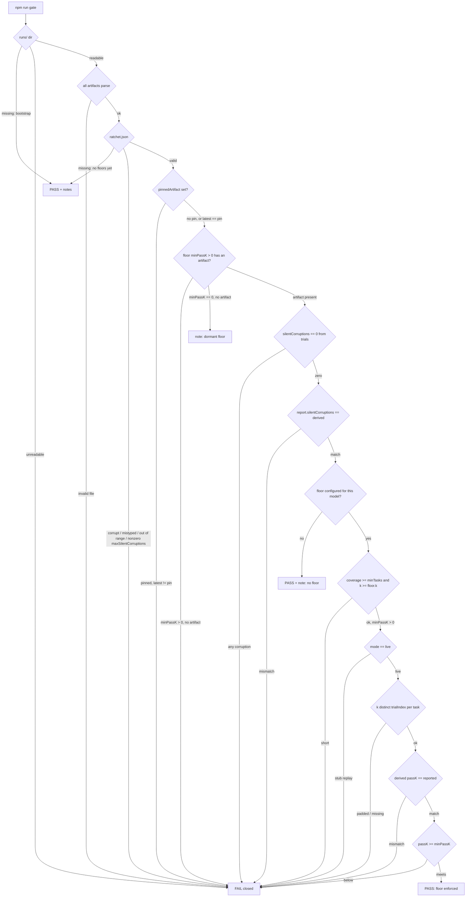

# Diagrams

## Gate decision flow (fail-closed)

Every reject edge converges on a hard FAIL. The only pass-with-notes paths are genuine bootstrap states (no runs yet, no floors configured) and dormant floors, which are named in the output rather than silently skipped. Source of truth: `harness/gate.ts`.

The check order below mirrors `evaluateGate`: config validation, then the
artifact-presence and rollback-pin checks, then — per artifact — the
silent-corruption invariant **first** (it is the hard invariant, enforced before
any floor), then the ratchet floor.

