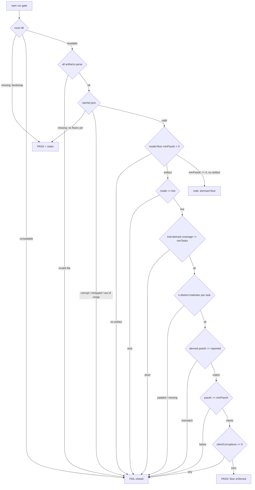

# Diagrams

## Gate decision flow (fail-closed)

Every reject edge converges on a hard FAIL. The only pass-with-notes paths are genuine bootstrap states (no runs yet, no floors configured) and dormant floors, which are named in the output rather than silently skipped. Source of truth: `harness/gate.ts`.

